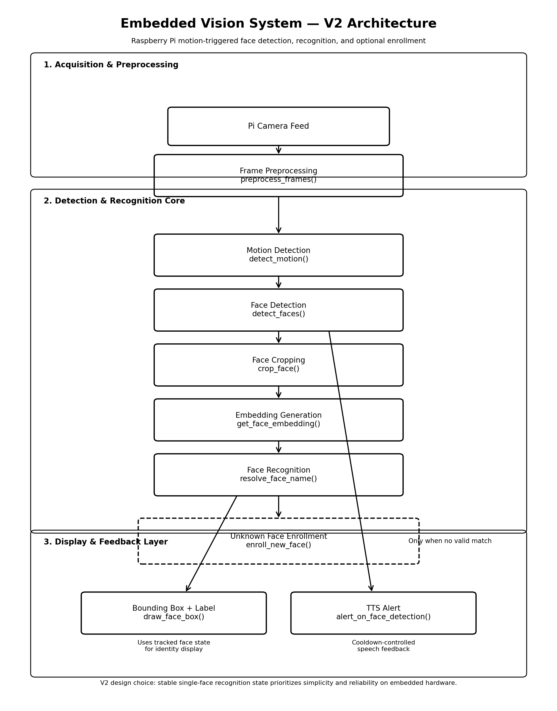

# Embedded Vision System (Raspberry Pi)

Lightweight embedded computer vision system for Raspberry Pi featuring motion detection, face detection, and face recognition with real-time feedback.

Originally developed as the vision component for a robotics concept, this project evolved into a general-purpose embedded computer vision platform designed to run efficiently on resource-constrained hardware.

The system demonstrates how a practical computer vision pipeline can detect motion, detect faces, recognize known individuals, and provide interactive feedback while minimizing unnecessary computation.

____________________________________________________________________________

# Features

• Real-time camera streaming  
• Motion detection using frame differencing  
• Face detection using OpenCV Haar cascades  
• Face recognition using 128D embeddings (`face_recognition` / dlib)  
• Runtime enrollment of unknown faces  
• Automatic dataset loading on startup  
• Event-driven processing (face detection runs only when motion occurs)  
• Bounding box visualization with identity labels  
• Text-to-speech alerts using pyttsx3  
• Designed for embedded hardware constraints  

____________________________________________________________________________

# System Architecture

Camera Frame  
↓  
Frame Preprocessing (grayscale + blur)  
↓  
Motion Detection  
↓  
Face Detection  
↓  
Face Cropping  
↓  
Embedding Generation  
↓  
Face Recognition  
↓  
Unknown Face Enrollment (optional)  
↓  
Bounding Box Rendering + Identity Label  
↓  
Optional User Feedback (Text-to-Speech)

Motion gating ensures that expensive operations like face detection and recognition only run when activity is detected. This approach helps maintain performance on embedded systems such as the Raspberry Pi.

##

____________________________________________________________________________

# Vision Processing Pipeline

The V2 system is structured as a modular pipeline implemented through helper functions.

Camera Frame  
↓  
`preprocess_frames()`  
Convert frames to grayscale and apply Gaussian blur.

↓  

`detect_motion()`  
Detect motion using frame differencing and contour detection.

↓  

`detect_faces()`  
Detect faces using OpenCV Haar cascades.

↓  

`crop_face()`  
Crop the detected face region and normalize it for recognition.

↓  

`get_face_embedding()`  
Generate a 128-dimensional facial embedding using `face_recognition`.

↓  

`resolve_face_name()`  
Compare embeddings against the known face dataset.

↓  

`enroll_new_face()`  
If the face is unknown, prompt the user and add it to the dataset.

↓  

`draw_face_box()`  
Render bounding boxes and identity labels on the video feed.

↓  

`alert_on_face_detection()`  
Trigger optional text-to-speech feedback.

This modular design keeps the system readable, maintainable, and easier to extend in future versions.

____________________________________________________________________________

# Version Progression

## Version 1 — Motion + Face Detection

File: `vision_system_v1.py`

Capabilities:

• Motion detection using frame differencing  
• Real-time video processing  
• Face detection using Haar cascades  
• Text-to-speech alerts  
• Embedded-friendly event-driven pipeline  

Goal: create a lightweight computer vision system that can run efficiently on Raspberry Pi hardware.

---

## Version 2 — Face Recognition

File: `vision_system_v2_face_recognition.py`

Adds:

• Face recognition using 128D embeddings  
• Automatic dataset loading  
• Runtime enrollment of unknown faces  
• Stable single-face recognition tracking  
• Modular helper-function architecture  

Goal: extend the system from **face detection to identity recognition**.

---

## Version 3 — Planned Improvements

Potential future improvements:

• Face tracking to reduce CPU usage  
• Multi-face recognition support  
• Detection event logging  

Goal: evolve the system toward a more robust embedded vision platform.

____________________________________________________________________________

# Repository Structure

vision_system_v1.py  
Initial implementation with motion detection and face detection.

vision_system_v2_face_recognition.py  
Extends the system with face recognition, dataset loading, and runtime enrollment.

haarcascade_frontalface_default.xml  
Pretrained OpenCV Haar cascade used for face detection.

face_dataset/  
Directory containing stored face images used for recognition.

requirements.txt  
Python dependencies required to run the project.

docs/
Project documentation assets such as architecture diagram

README.md  
Project documentation.

____________________________________________________________________________

# Dataset Structure

Recognized faces are stored in a simple directory structure.

face_dataset/

Person_A/  
image1.jpg  
image2.jpg  

Person_B/  
image1.jpg  

When the system encounters an unknown face, it prompts the user to enter a name and automatically saves the image to the dataset for future recognition.

____________________________________________________________________________

# Tech Stack

Python  
OpenCV  
face_recognition / dlib  
NumPy  
pyttsx3 (text-to-speech)  
Raspberry Pi  
PiCamera2  

____________________________________________________________________________

# Hardware

Raspberry Pi  
Raspberry Pi Camera Module (PiCamera2)

____________________________________________________________________________

# Installation

Clone the repository:

git clone https://github.com/RussSoto/BarBot-Vision.git

cd BarBot-Vision

Install dependencies:

pip install -r requirements.txt

____________________________________________________________________________

# Running the System

python vision_system_v2_face_recognition.py

The program will open the camera feed and monitor for motion and faces in real time.

When an unknown face is detected, the system prompts for a name and adds it to the recognition dataset.

____________________________________________________________________________

# Engineering Focus

This project focuses on building a practical embedded vision system, emphasizing:

• Real-time video processing  
• Efficient computer vision pipelines  
• Embedded hardware constraints  
• Integration of machine learning libraries into working systems  

The goal is not to train machine learning models from scratch but to build reliable systems that deploy existing computer vision tools effectively on edge devices.

____________________________________________________________________________

# Potential Applications

• Robotics vision systems  
• Smart home monitoring  
• Security systems  
• Human-machine interaction  
• Edge AI experimentation  

____________________________________________________________________________

# License

MIT License

Built by Russell Soto  
See you, space cowboy.
